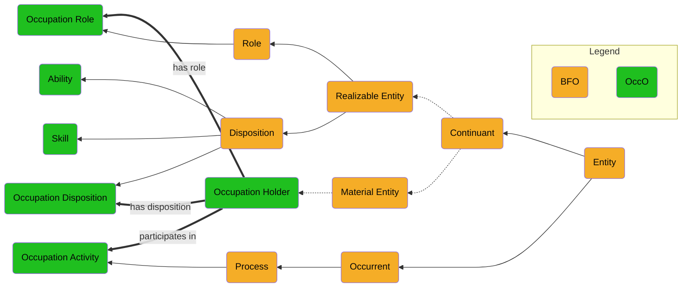

# OccO

OccO: Occupation Ontology
The Occupation Ontology (OccO) is an ontology in the domain of human occupations. OccO is an initial ontological presentation of information taken from a standardized occupation taxonomy, the US Standard Occupational Classification (SOC) as enhanced by the **O*Net** system.  These systems have been developed by the following US Federal agencies:
- Department of Labor 
- Bureau of Labor Statistics
- The O\*NET Program, the United States' primary source of occupational information. 

OccO reflects the data content of the **O\*Net-SOC 2019** taxonomy, which is based on the 2018 SOC, and it is developed by following OBO Foundry principles. 
The data used is from [O\*Net data](https://www.onetonline.org/) by the U.S. Department of Labor, Employment and Training Administration (USDOL/EGA).  It is used under the [CC BY 4.0](https://creativecommons.org/licenses/by/4.0/) license.  USDOL/ETA has not approved, endorsed or tested these modivications.

  

**Occupational Attributes as Object Properties** The O\*net system associates a number of occupational attributes such as skills, abilities, knowledge, to each occupation.  To illustrate the incorporation of such attributes into OccO, the skill and ability attributes are treated as object properties "has skill" and "has ability."  These properties are represented in an example occupation, "pharmacist," to illustrate how they are structured in OWL.  Extending these properties to every occupation is a topic for later study, ideally harmonizing with the treatment of skills in other taxonomies, in particular with the extensive treatment of skills in the European Union European Skils, Competences, Qualifications and Occupations (ESCO) classification system.

OccO was initiated by Sam Smith and Oliver He, at the University of Michigan Medical School, Ann Arbor, MI, USA. Then its development includes more members, including Damion Dooley of Simon Fraser University, Vancouver, BC, Canada, and John Beverley and Eric Merrell from University at Buffalo. 

OccO was initially developed as part of the Role Ontology (RoleO) as seen here in BioPortal: https://bioportal.bioontology.org/ontologies/ROLEO. 

## Developers:
- Sam Smith
- Oliver He
- John Beverley
- Matthew Diller
- William R. Hogan
- William Duncan
- Jie Zheng
- Robin McGill

## Contributors:
- Eric Merrell
- Damion Dooley
- John Judkins

## OccO Publications:

John Beverley, Sam Smith, Matthew A Diller, William D. Duncan, Jie Zheng, John W. Judkins, William R. Hogan, Robin McGill, Damion Dooley, Yongqun He. The Occupation Ontology (OccO): Building a Bridge between Global Occupational Standards. Proceedings of The International Workshop on Ontologies for Social Services (OSS2023), July 17-20, 2023, in Sherbrooke, Quebec, Canada in conjunction with FOIS 2023. Pages 1-12. [Slides](https://github.com/johnbeve/OccO/files/12165828/Occupation.Ontology.pptx)

Sam Smith, Yongqun He, Damion Dooley, Eric Merrell, and John Beverley. Toward an Occupation Ontology, OccO. The 2022 International Conference on Biomedical Ontology (ICBO 2022), October 5, 2022, Ann Arbor, MI, USA. PDF: [https://icbo-conference.github.io/icbo2022/papers/ICBO-2022_paper_5061.pdf](https://icbo-conference.github.io/icbo2022/papers/ICBO-2022_paper_5061.pdf). Flash talk: [https://icbo-conference.github.io/icbo2022/flash-talks/Occupation_Ontology.pdf](https://icbo-conference.github.io/icbo2022/flash-talks/Occupation_Ontology.pdf). 

Sam Smith, Damion Dooley, Yongqun He. Foundational Development of an Occupation Ontology. Proceedings of The International Workshop on Ontologies for Social Services (OSS2022), 15-19 August 2022, Jönköping University, Jönköpin, Sweden. Pages 1-11.  [https://ceur-ws.org/Vol-3249/paper6-OSS.pdf](https://ceur-ws.org/Vol-3249/paper6-OSS.pdf). 

## References:

- Standard Occupational Classification (SOC) System: https://www.bls.gov/soc/ 
- O\*Net Resource Center:  https://www.onetcenter.org 

